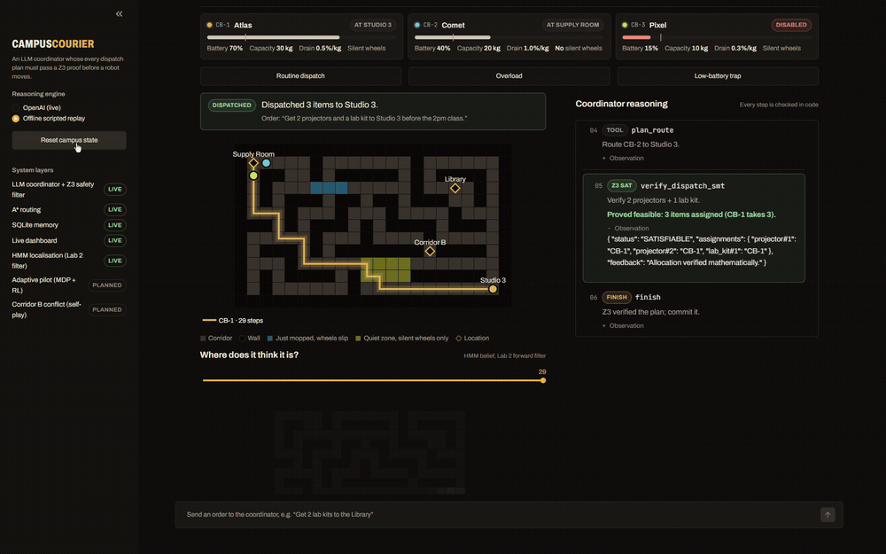

# CampusCourier

An LLM coordinator for campus delivery robots, where **every dispatch plan must be proved safe by a Z3
solver before a robot moves**.

<!-- Demo GIF: record 15 seconds (Reset campus state, then Overload), save as demo.gif beside this
     README, and uncomment the line below. -->
<!--  -->

Three courier robots carry projectors, lab kits and water cases from the Supply Room to the rooms that
asked for them. Staff type an order in plain English. An LLM turns it into a structured plan, and three
gates in code decide whether that plan is allowed to happen.

**The one line: the LLM proposes, the maths decides.**

---

## Install and run

```bash
git clone https://github.com/AgentsDecisionMaking-Krea/Comp-343-2026-s006.git
cd Comp-343-2026-s006/FinalProject-CampusCourier
python -m venv .venv
.venv\Scripts\python -m pip install -r requirements.txt
```

### Add your own API key

The project never contains a key. It reads one from the environment.

```bash
copy .env.example .env      # Windows
cp .env.example .env        # macOS / Linux
```

Then open `.env` and paste your own OpenAI key after `OPENAI_API_KEY=`. Get one from
<https://platform.openai.com/api-keys>. `.env` is listed in `.gitignore`, so it is never committed.

**You do not need a key to run the project.** Without one, the dashboard falls back to
**Offline scripted replay**, which runs the same three stories with no network call at all.

### Run the dashboard

```bash
.venv\Scripts\python -m streamlit run app.py
```

It opens at <http://localhost:8511>. Start it from this folder so `.streamlit/config.toml` (the theme) is
picked up. In VS Code you can instead press **F5** and choose "Dashboard (Streamlit)".

### Run without the interface

```bash
python agent.py              # offline routine story
python agent.py --overload   # offline, the one Z3 refuses
python agent.py --live       # uses your API key
```

### Run the tests

```bash
.venv\Scripts\python test_agent.py
```

Seven checks, all offline against a throwaway database: routine dispatch, UNSAT recovery, low-battery
refusal, invented numbers blocked, repeated UNSAT blocked, battery drain blocking a load that capacity
alone would allow, and quiet-zone avoidance.

---

## What each file does

### The scenario and interface (my own integration code)

| File | What it does |
|---|---|
| `app.py` | The Streamlit dashboard: map, robot cards, reasoning log, verdict panel, task log, stock table, and all the CSS. The only file that imports Streamlit. |
| `agent.py` | The ReAct loop, the tool definitions, the three verification gates, and the offline scripted stories used when there is no API key. |
| `world.py` | The campus floor map as ASCII, plus the adapters that feed it to the Lab 1 A* planner. Masks the quiet-zone cells for robots without silent wheels. |
| `memory.py` | SQLite state: the `robots`, `supplies` and `tasks` tables, the seed data, and `record_dispatch()`. |
| `perception.py` | Runs the Lab 2 forward filter over the campus floor: builds the transition and emission models from the map, simulates a noisy walk along a planned route, and returns the belief for the dashboard heatmap. No algorithm here, only the translation between the map and the shapes the lab code expects. |
| `wandb_log.py` | Optional Weights & Biases logging of each run. Off unless `WANDB_ENABLED=1`. |
| `test_agent.py` | The seven safety checks described above. |
| `ui_prototype.py`, `UI_Draft.html` | An early Tkinter prototype and a wireframe, kept for history. Not used by the demo. |
| `presentation/` | Scripts and images used to render maps for the slide deck. |

### The algorithms (reused lab code, in `core/`)

Per the project guidelines these are my existing lab files, corrected but not rewritten. A diff against
the original labs returns only the corrections listed here.

| File here | Original lab submission | Path inside that zip | Changes |
|---|---|---|---|
| `core/planner.py` | `Lab1.zip` | `Lab1/planner.py` | none, byte identical |
| `core/environment.py` | `Lab1.zip` | `Lab1/environment.py` | none, byte identical |
| `core/models.py` | `Lab1.zip` | `Lab1/models.py` | none, byte identical |
| `core/hmm_filter.py` | `Aryan_Grang_Lab2.zip` | `Lab2/hmm_filter.py` | my completed Lab 2 submission, dropped in as submitted. It passes the lab's own `hmm_test.py` (3 tests) |
| `core/hmm_environment.py` | `Lab2.zip` | `Lab2/hmm_environment.py` | whitespace only, the tab and space mix made it un-importable |
| `core/verifier.py` | `Lab(Updated).zip` | `Lab/verifier.py` | Task 0 fixed (capacity `>=` to `<=`), and Task 4's `battery_drain_constraint` implemented |

Patterns reused rather than files copied:

| Where | Original lab submission | Path inside that zip | How it is used |
|---|---|---|---|
| `agent.py` ReAct loop | `ReAct Lab_Aryan.zip` | `ReAct Lab/react_loop_lab.py` | the thought / action / observation loop structure, adapted to this project's tools |
| `agent.py` offline engine | `ReAct Lab_Aryan.zip` | `ReAct Lab/scripted_llm.py` | the idea of replaying a fixed step list when there is no API key |
| `memory.py` | `ReAct Lab_Aryan.zip` | `ReAct Lab/fake_db.py` | the on-disk SQLite seed-and-reset pattern |

Planned layers will reuse, unchanged, from:

| Planned layer | Original lab submission |
|---|---|
| Adaptive pilot, value iteration | `Lab_3_Aryan.zip` |
| Adaptive pilot, Q-learning and the Corridor B self play | `Q learning_Aryan.zip` |
| Prediction baselines if needed | `RL-Prediction-Lab-1_Aryan_final.zip` |

All of the above zips sit in the parent coursework folder alongside this project.

### Config and data

| File | What it does |
|---|---|
| `requirements.txt` | Pinned versions of every dependency. |
| `.env.example` | Template for your own key. Copy to `.env`. |
| `.gitignore` | Keeps `.env`, the database, the virtual environment and the W&B run files out of git. |
| `.streamlit/config.toml` | The dark theme. |
| `.vscode/launch.json` | F5 run configurations for the dashboard, the tests and the CLI story. |
| `campus_courier.db` | The SQLite database. Generated on first run, rebuilt by "Reset campus state". |
| `Project Proposal.md` | The full write up of the design and which coursework each layer reuses. |

---

## How it works

An order passes through six stages, and stops at the first one it fails.

1. **Order in.** Free text, e.g. "get 2 projectors and a lab kit to Studio 3 before the 2pm class".
2. **ReAct loop.** The LLM emits one JSON action at a time: thought, action, observation. Arguments are
   validated with Pydantic before anything runs.
3. **Tools fetch facts.** Fleet and stock come from SQLite, never from the model's memory.
4. **A\* plans routes.** Lab 1's planner on the corridor grid with the Manhattan heuristic. For a robot
   without silent wheels, the quiet-zone cells are removed from the grid before planning, so an illegal
   route cannot be produced.
5. **Z3 verifies.** One integer variable per item meaning "which robot carries this", plus constraints for
   assignment, capacity and battery drain. SAT returns a model; UNSAT returns diagnostics naming the
   constraint that failed.
6. **Commit gate.** The dispatch is refused unless it equals Z3's own model and every assigned robot has a
   reachable route. Only then does the database change.

### The three gates

1. **Grounding.** Every robot spec and item weight in the model's payload is compared field by field
   against the database. This stops the model answering a refusal by inventing a fuller battery.
2. **SMT.** Z3 must return SAT. On UNSAT the diagnostics go back to the model, and an identical
   resubmission is refused, so retries have to be genuinely different.
3. **Commit.** As described in stage 6 above.

---

## Weights & Biases

Run metrics are logged optionally. Install and log in, then set `WANDB_ENABLED=1` in `.env`:

```bash
pip install wandb
wandb login
```

Each dispatch logs: steps taken, tool calls, Z3 SAT and UNSAT counts, gate blocks, schema errors,
verifier attempts, whether it dispatched, items assigned, robots used and total route steps.

To reproduce the logged runs for all three stories in one go:

```bash
python wandb_log.py --demo
```

**Report (open to anyone with the link):** <https://forge.coreweave.com/wandb/harsh_dixit-sias22-krea-university-top-university-for-li/campuscourier/reports/CampusCourier-verified-dispatch-runs--VmlldzoxODA0OTM4MA?accessToken=z9is6gbvzf5s5u74ndkgk84kmxruqn395mgs732awlyejsb4siqu3pqvwhkrkt5c>

**Project:** <https://wandb.ai/harsh_dixit-sias22-krea-university-top-university-for-li/campuscourier>
(the project itself is team-visible; the report link above is the one to use)

The three runs there are the routine dispatch (dispatched, one Z3 SAT), the overload
(dispatched after one Z3 UNSAT and a replan, so two verifier attempts), and the low-battery
trap (not dispatched, one Z3 UNSAT, which is the correct outcome).

---

## Limitations and safety considerations

Known limitations in this version:

- **The filter tracks loosely, which is the honest result.** A wall count from 0 to 4 is weak evidence in
  a corridor grid where many cells look alike, so the belief names the exact cell roughly 45 to 70% of the
  time and lands within one cell roughly 75 to 80% of the time, depending on the route. It is a real
  forward filter, not a demonstration rigged to look confident.
- **The belief starts at the known dock, not uniform.** The robot undocks from a known room, so
  `perception.py` seeds the belief on that cell. With a uniform prior over the whole floor, which is the
  harder "woken up lost" problem, tracking drops to around 28%.
- **The true path does not slip, but the filter assumes it might.** The simulated robot follows the A*
  route exactly, while the transition model allows sideways slips, so the belief spreads more than the
  truth does.
- **The quiet-zone rule is enforced in the map, not in the solver.** Cells are removed before A* plans.
  That makes an illegal route impossible to produce, but the rule is not stated as a Z3 constraint, so it
  is not part of the formal proof.
- **No round-trip reserve.** Battery is checked for the outbound trip only.
- **The adaptive pilot and the Corridor B conflict rule are designed but not built**, so the slip model
  and the single-lane contention are described rather than demonstrated.
- **Offline replay is scripted.** It exercises the real gates, the real solver and the real planner, but
  the coordinator's decisions are fixed. It is evidence that the checking works, not that the live model
  behaves well.

Safety considerations:

- **No key is stored in the repository.** The key is read from the environment, `.env.example` carries no
  value, and `.env` is gitignored.
- **The LLM cannot act directly.** It can only call declared tools with schema-validated arguments, and
  no tool writes to the database except through the commit gate.
- **Refusals are explicit.** When a plan is rejected the system reports what failed rather than silently
  substituting a different robot, so an operator always learns that their instruction was impossible.
- **The verifier is only as good as the constraints encoded in it.** A rule that is not written as a
  constraint is not enforced, which is why the limitation about the quiet zone above matters.
- **Simulation only.** No physical robots are controlled by this code.

---

## Repository

**GitHub:** <https://github.com/AgentsDecisionMaking-Krea/Comp-343-2026-s006/tree/main/FinalProject-CampusCourier>
